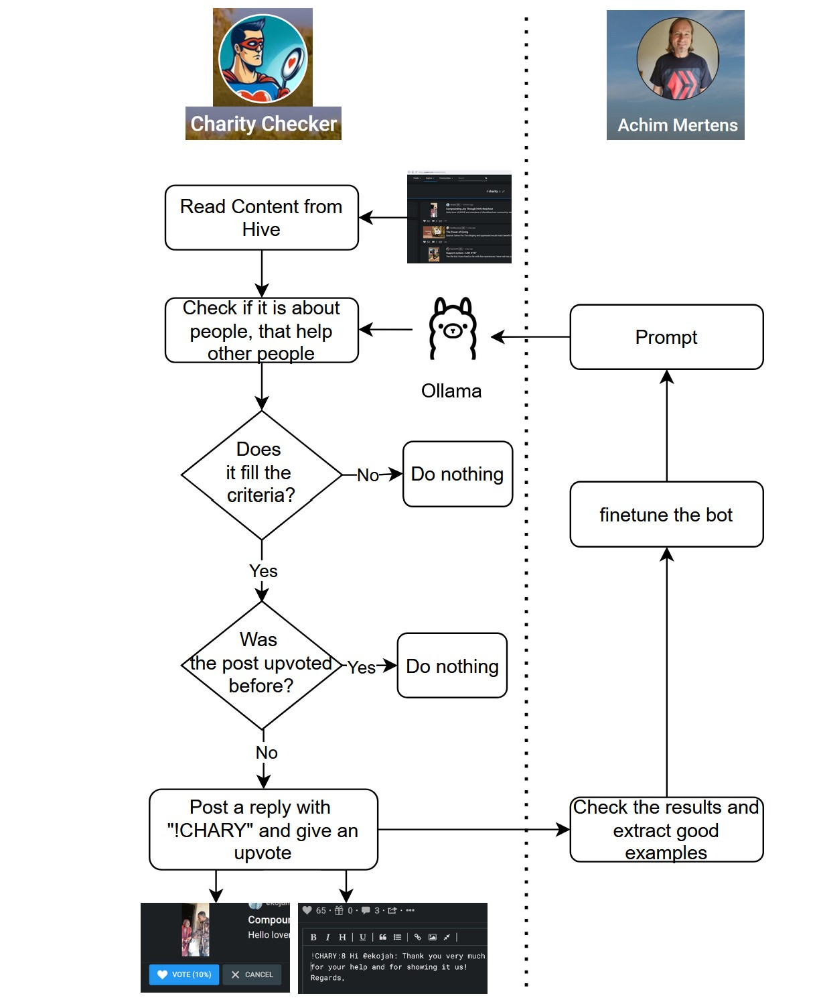

# Überblick
Dieser Charitiy-Detector ist eine Ansammlung von Scripts, die:
- in der Hive Blockchain ein paar Foren durchsuchen, 
- den Body einiger Posts runter laden, 
- den Inhalt auf karitative Aktionen mit einer von mir trainierten KI überprüfen 
- und anschließend ein Upvote und einen Kommentar mit einem Schlüsselwort posten.

# Hier der Befehl um das Modefile zu bauen:
Einmalig: ollama show llama3 --modelfile > Charyllama3.modelfile
Dann den Text aus charity_examples.txt hinter dem letzten "PARAMETER" und vor dem "LICENSE" Abschnitt in das File einfügen. Danach:
ollama create charyllama3 --file Charyllama3.modelfile

# Aufruf der Scripte:
Hier die Startreihenfolge:
1. node daily_checks.js laufen lassen. Es startet:
   1. fetchHive.js -> "./reports/posts_YYMMDD_charity.json" + "/.reports/posts_YYMMDD_help.json" mit den Posts und ein paar Meta-Feldern aus Hive.
   2. processContent.js -> "./reports/results_YYMMDD_charity.json" + "/.reports/results_YYMMDD_help.json" -> Das Programm ruft n mal ask_ollama.js auf und braucht entsprechend lange. Die Dateien beinhalten Zusammenfassungen und Auswertungen der Posts.
2. Manuell "./reports/results_YYMMDD_charity.json" + "/.reports/results_YYMMDD_help.json" überprüfen und die relevanten Zeilen "secondResult" duplizieren (Alt+Shift+Pfeilnachunten), in "AchimResult" umbenennen und nach Wunsch anpassen.
3. node create_replies.js -> Es wird nach !CHARY gefiltert (also die rausgefiltert, die schon mal bewertet wurden) und reports/replies_YYMMDD.json gespeichert
4. node processReplies.js -> Es werden die neuen Replies in reports/allreplies.json hinzugefügt und es wird ein tagesaktueller reports/replies_YYMMDD.json erstellt.
5. node postRepliesToHive.js -> Die Einträge aus replies.json werden gelesen und zu den jeweiligen Posts wird ein Upvote und ein Kommentar gesendet. Dabei wird in reports/allreadyUpvoted.json geschaut, ob der Post schon bearbeitet wurde. Im Anschluss werden die neuen Einträge hinzugefügt.

6. Die letzten Reports sammeln (z.B. in nextreports.json)
7.  node createCharityReport.js reports/next_report.json
8.  Den Report anschauen. Wenn er gefällt, umbenennen in reports/yyyymmdd_report.md 
9.  Den Report hochladen mit node postReportToHive.js reports/yyyymmdd_report.md
10. Ergebnis checken und rebloggen.

# Nächste Stufen:
- Die positiven Beiträge aus results_2.json kopieren und in eine "nextReport.json" übertragen. Dafür sorgen, dass Beiträge eindeutig sind.
- Daraus einen schönen Report mit "Held der Woche" einführen. (Bisschen KI Text, warum die Person die Heldin ist.)
- Scoring einführen, nur Beiträge bewerten, deren Autor eine Reputation höher 40 hat.
- Upvote in Abhängigkeit vom Chary-Score vergeben

# Done Juli 2024:
- Ein script schreiben, das replies.json auswertet und die Kommentare hochlädt.
- (Die KI mit Beispieldaten trainieren und ein neues Modell erstellen. Tierbeispiele entfernen.)
- Dafür sorgen, dass Beiträge nur einmal geupvoted und replied werden

