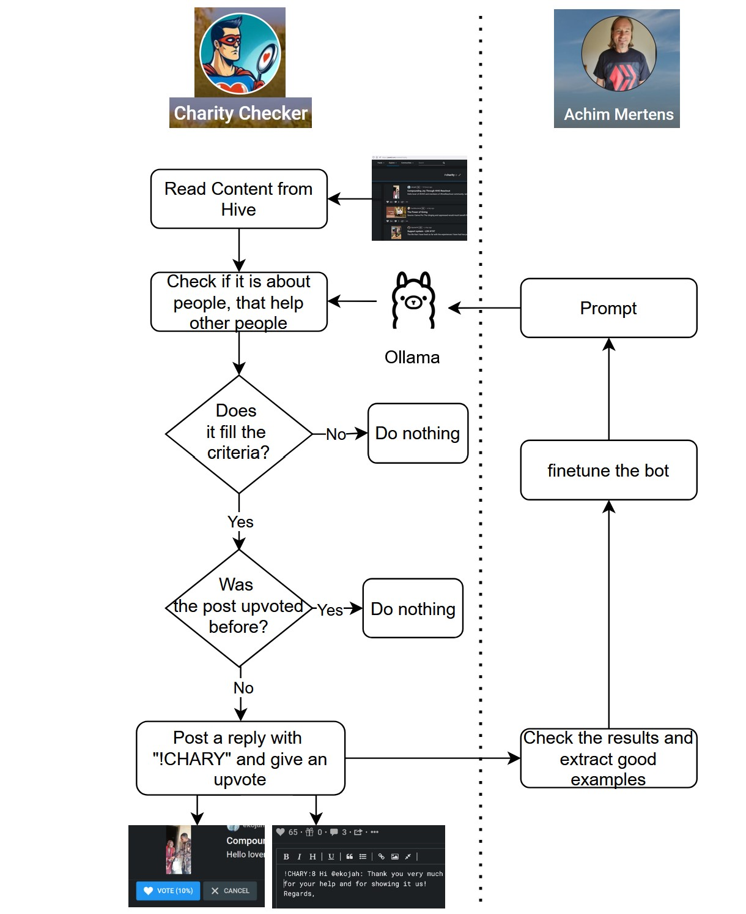

# Überblick
Dieser Charitiy-Detector ist eine Ansammlung von Scripts, die:
- in der Hive Blockchain ein paar Foren durchsuchen, 
- den Body einiger Posts runter laden, 
- den Inhalt auf karitative Aktionen mit einer von mir trainierten KI überprüfen 
- und anschließend ein Upvote und ggf. einen Kommentar mit einem Schlüsselwort posten.

# Hier der Befehl um das Modefile zu bauen:
Einmalig: ollama show llama3 --modelfile > Charyllama3.modelfile
Dann den Text aus charity_examples.txt hinter dem letzten "PARAMETER" und vor dem "LICENSE" Abschnitt in das File einfügen. Danach:
ollama create charyllama3 --file Charyllama3.modelfile

# Aufruf der Scripte:
Hier die Startreihenfolge:
1. node fetchhive.js (wobei hier ggf. die URL angepasst werden sollte) -> es entsteht contents.json mit den Posts und ein paar Meta-Feldern aus Hive.
2. node process_contents.js -> Das Programm ruft n mal ask_ollama.js auf und braucht entsprechend lange. Es entsteht results.json mit den Zusammenfassungen und results_02.json mit den Auswertungen der Posts.
3. node create_replies.js -> Es wird nach !CHARY gefiltert und replies.json gespeichert
4. node postToHive.js -> Die Einträge aus replies.json werden gelesen und zu den jeweiligen Posts wird ein Upvote und ein Kommentar gesendet. Dabei wird in allreadyUpvoted.json geschaut, ob der Post schon bearbeitet wurde. Im Anschluss werden die neuen Einträge hinzugefügt.

# Nächste Stufen:

- Scoring einführen, nur Beiträge bewerten, deren Autor eine Reputation höher 40 hat.
- Upvote in Abhängigkeit vom Chary-Score vergeben

# Done Juli 2024:
- Ein script schreiben, das replies.json auswertet und die Kommentare hochlädt.
- (Die KI mit Beispieldaten trainieren und ein neues Modell erstellen. Tierbeispiele entfernen.)
- Dafür sorgen, dass Beiträge nur einmal geupvoted und replied werden

